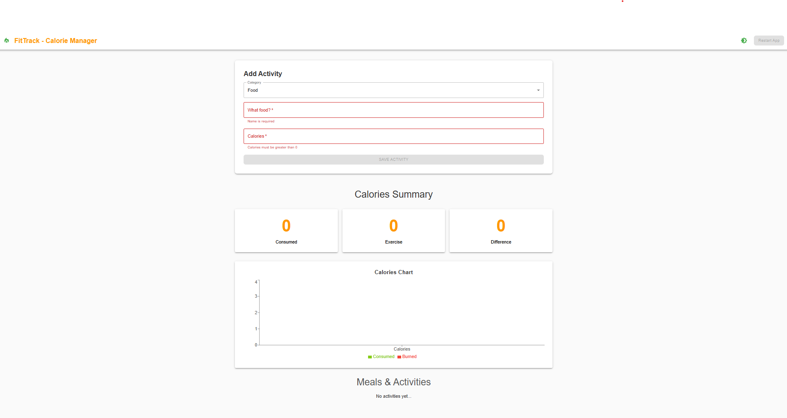
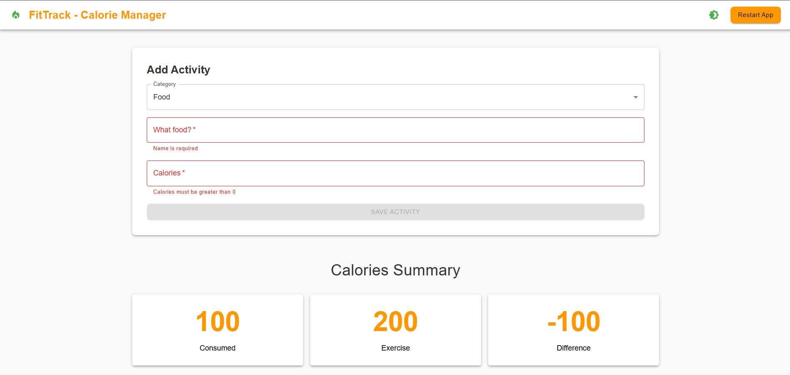
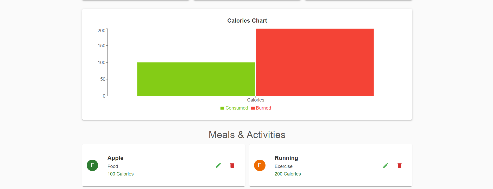

# 🥗 FitTrack - Calorie Manager



**FitTrack** is a responsive calorie tracking web application built with
**React + TypeScript**, styled with **Material UI**, and powered by **Context
API** + `useReducer` for global state management. It allows users to log meals
and exercises to monitor their daily calorie intake, burn, and net balance.

## 🚀 Live Demo

👉 [Live Demo on Netlify](https://fittrack-dev.netlify.app/)

---

## 🧠 Technologies Used

- ⚛️ **React 18** with **TypeScript**
- 🎨 **Material UI (MUI)**
- 🧠 **Context API** + `useReducer`
- 📊 **Recharts** for data visualization
- 🍿 **notistack** for snack notifications
- 🌗 Light and dark mode support
- 💾 LocalStorage persistence
- ⚡ Built with Vite

---

## 📸 Screenshots

| Add Activity                     | Summary                          | Meals & Activities               |
| -------------------------------- | -------------------------------- | -------------------------------- |
|  |  |  |

---

## 🗂️ Folder Structure

src/ ├── components/ # Main visual components ├── context/ # Global contexts and
providers ├── data/ # Static data (categories) ├── hooks/ # Custom React hooks
├── reducers/ # State management with useReducer ├── types/ # TypeScript type
definitions ├── App.tsx # Root component └── main.tsx # App entry point

---

## ✨ Features

✅ Add meals or exercises  
✅ See calories consumed, burned, and net difference  
✅ View bar chart summary  
✅ Edit and delete existing records  
✅ Toggle between light and dark mode  
✅ Responsive design  
✅ LocalStorage data persistence (no backend required)

---

## 📦 Installation

1. Clone the repository

```bash
git clone https://github.com/guillevarelabarros/fittrack-calorie-manager.git
cd fittrack-calorie-manager
```

---

## ✨ Features

✅ Add meals or exercises  
✅ See calories consumed, burned, and net difference  
✅ View bar chart summary  
✅ Edit and delete existing records  
✅ Toggle between light and dark mode  
✅ Responsive design  
✅ LocalStorage data persistence (no backend required)

---

## 📦 Installation

```bash
1. Clone the repository
git clone https://github.com/guillevarelabarros/fittrack-calorie-manager.git
cd fittrack-calorie-manager


2. Install dependencies
yarn install

3. Run the development server
yarn dev

4. Build for production
yarn build
```

## 🧪 What This Project Demonstrates

This project showcases:

Global state management with React Hooks (without Redux)

Clean modular code architecture

Strong grasp of React + TypeScript + MUI

Real-world UI with responsive and accessible components

Usage of modern libraries and best practices

Clear separation of concerns and reusable components

## 🧑‍💻 Author

**Guille Varela Barros** – [LinkedIn](www.linkedin.com/in/guillevarelabarros) |
[Github](https://github.com/guillevarelabarros)

If you liked this project, please ⭐ it and feel free to connect!

## 📝 License

"It’s not just about counting calories — it’s about taking control." — Guille 💪
